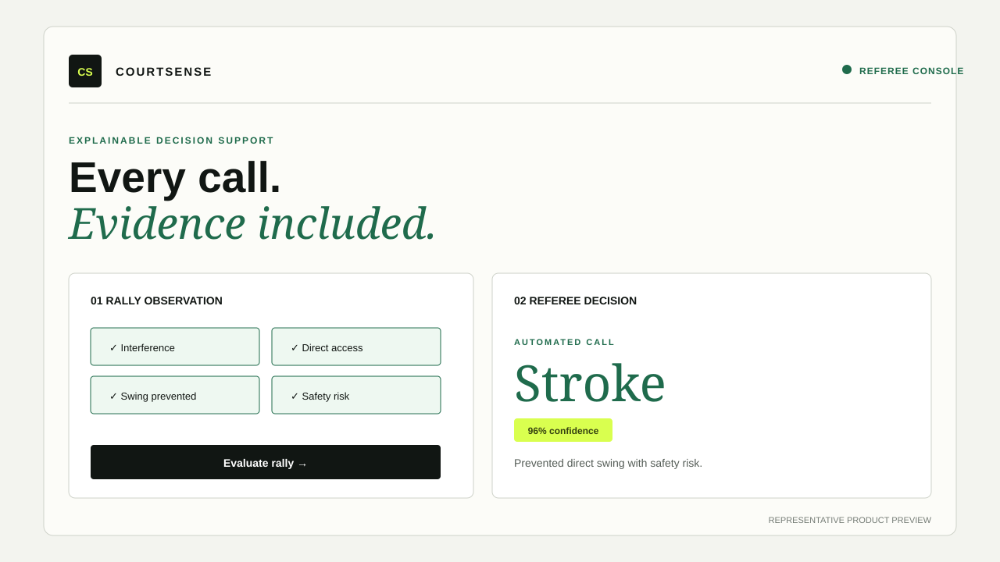
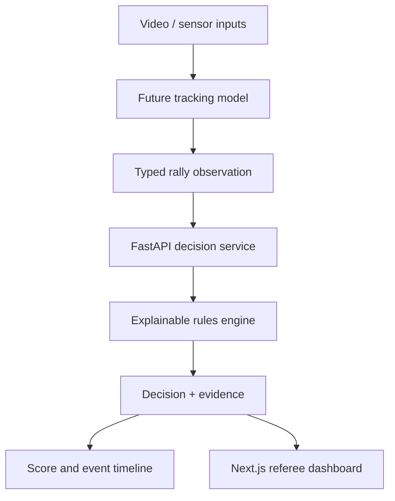

# AI-Powered Squash Referee System

A full-stack decision-support platform that converts structured rally observations into explainable squash calls, match scoring, and an auditable event timeline.



> **Representative product preview:** the UI is implemented in `frontend/`; this SVG makes the repository understandable without cloning it.

> This portfolio implementation demonstrates the software architecture and rules layer. It does **not** claim tournament certification or trained computer-vision accuracy. A future vision pipeline can publish observations through the same typed API.

## The problem

Squash decisions happen quickly and can depend on several facts at once: tin contact, out-of-court contact, bounce count, interference, direct access, swing prevention, and player safety. A useful engineering system must produce a decision quickly while also explaining the evidence and escalating uncertain observations.

## What I built

- A deterministic, testable rules engine for `good return`, `fault`, `down`, `out`, `double bounce`, `stroke`, `yes let`, and `no let`
- Confidence-aware human review for ambiguous observations
- FastAPI endpoints with typed Pydantic request/response contracts
- Match scoring, game completion, and an auditable event timeline
- A responsive Next.js dashboard for decisions and live scorekeeping
- Reproducible synthetic evaluation fixtures and reported metrics
- Docker Compose and GitHub Actions CI for repeatable delivery

## Architecture



The rules service is isolated from the observation source. A future CV model can be added without rewriting scoring, API contracts, evaluation, or the user interface.

## Decision precedence

1. Low-confidence or ambiguous observation → human review
2. Invalid serve → fault
3. Tin contact → down
4. Out-line contact → out
5. Two or more bounces → double bounce
6. Prevented swing with direct access or safety risk → stroke
7. Interference with recoverable direct access → yes let
8. Interference without meaningful access → no let
9. Otherwise → good return

## Tech used

**Python, FastAPI, Pydantic, pytest, Next.js, React, TypeScript, Docker, GitHub Actions**

## Outcomes

This repository ships an end-to-end engineering baseline rather than an accuracy claim:

| Capability | Result |
|---|---|
| Rules fixture accuracy | 100% on the versioned synthetic evaluation set |
| Safety-critical recall | 100% on the versioned synthetic safety cases |
| Decision explainability | Every response includes evidence and a human-readable rationale |
| Reproducibility | One-command evaluation and containerized local startup |
| Quality gates | Backend tests, linting, frontend type-check/build, and container validation in CI |

Metrics above apply only to `evaluation/cases.jsonl`; they do not represent real match or computer-vision performance.

## API example

```bash
curl -X POST http://localhost:8000/api/v1/decisions \
  -H "Content-Type: application/json" \
  -d '{
    "rally_id": "rally-42",
    "interference": true,
    "striker_had_direct_access": true,
    "opponent_prevented_swing": true,
    "safety_risk": true,
    "observation_confidence": 0.96
  }'
```

```json
{
  "rally_id": "rally-42",
  "decision": "stroke",
  "confidence": 0.96,
  "human_review_required": false,
  "reason": "The opponent prevented a direct swing and created a safety risk.",
  "evidence": ["opponent_prevented_swing", "striker_had_direct_access", "safety_risk"]
}
```

Interactive API documentation is available at `http://localhost:8000/docs`.

## Run locally

### Docker Compose

```bash
git clone https://github.com/ParamasivaVemavarapu/AI-Powered-Squash-Referee-System-.git
cd AI-Powered-Squash-Referee-System-
docker compose up --build
```

Open:

- Dashboard: http://localhost:3000
- API documentation: http://localhost:8000/docs
- Health check: http://localhost:8000/health

### Without Docker

```bash
cd backend
python -m venv .venv
source .venv/bin/activate
pip install -r requirements-dev.txt
uvicorn app.main:app --reload
```

In another terminal:

```bash
cd frontend
npm install
NEXT_PUBLIC_API_URL=http://localhost:8000 npm run dev
```

## Test and evaluate

```bash
cd backend
pip install -r requirements-dev.txt
pytest

cd ..
python evaluation/evaluate.py
```

## Deployment

- **Frontend:** deploy `frontend/` to Vercel and set `NEXT_PUBLIC_API_URL` to the public backend URL.
- **Backend:** deploy the repository with `backend/Dockerfile` on Render, Railway, Fly.io, or another container platform.
- **CORS:** set `CORS_ORIGINS` to the deployed frontend origin.
- **Health check:** configure the platform to call `/health`.

## Roadmap

- Train and evaluate court calibration, ball tracking, and player-pose models on licensed match footage
- Measure event-level precision/recall and end-to-end decision latency on held-out matches
- Add WebSocket observation streaming and replay synchronization
- Add authentication, durable match persistence, and referee override analytics
- Validate rules and workflows with qualified squash officials

## License

MIT
